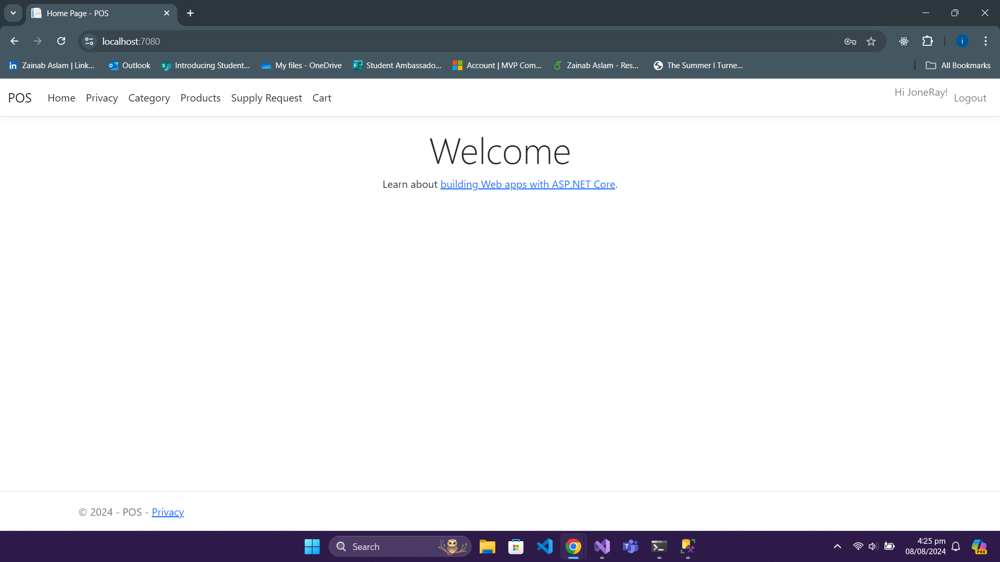
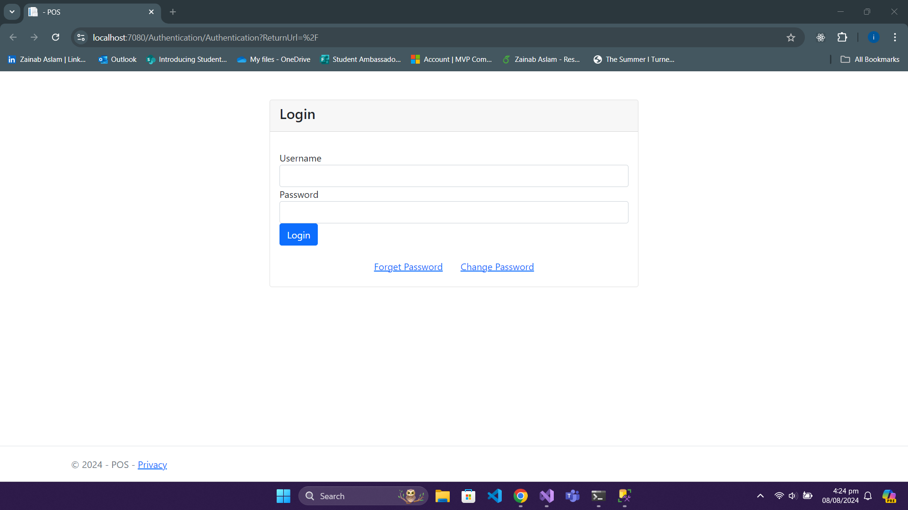
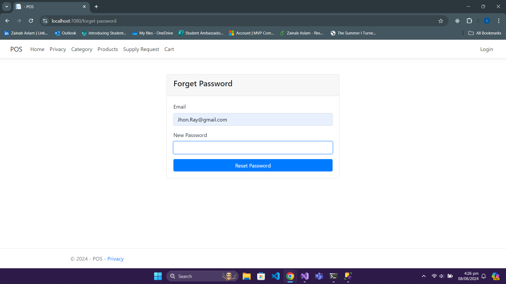
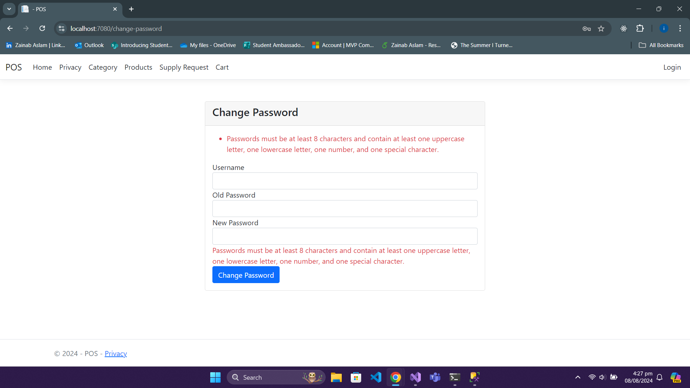
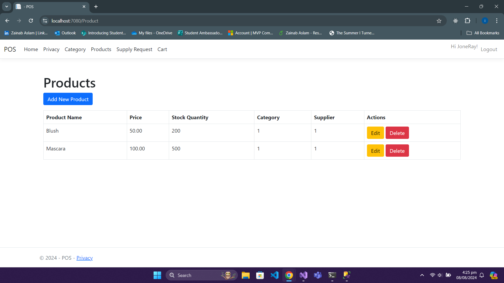
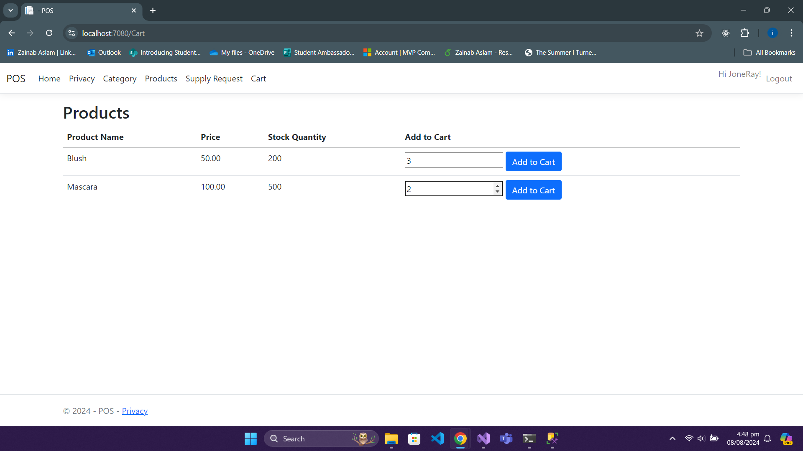
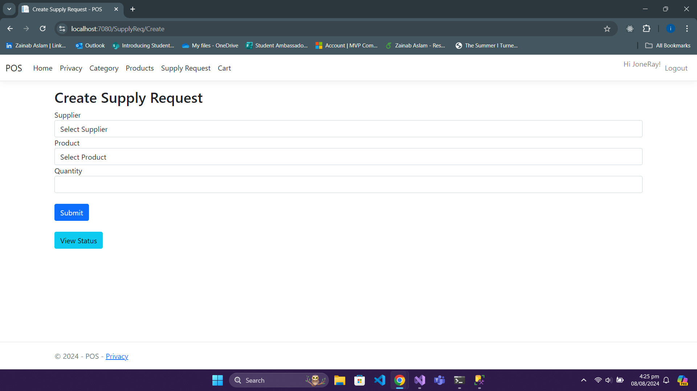
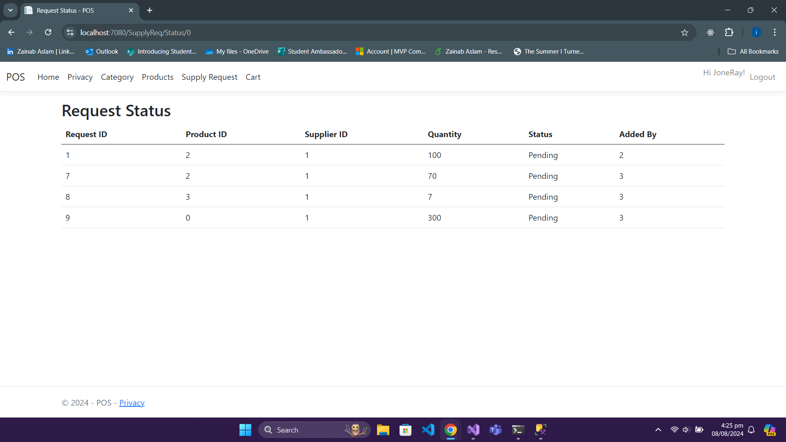
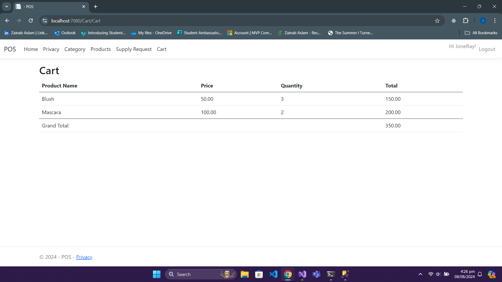

# POS .NET MVC Application

## Introduction

This project is a Point of Sale (POS) application built using ASP.NET Core MVC (.NET 8) with SQL Server for database management. The application integrates with SQL Server using Entity Framework Core and includes features such as user authentication, password management, and core POS functionalities.

## Getting Started


### Prerequisites

- [.NET 8 SDK](https://dotnet.microsoft.com/download/dotnet/8.0) installed on your machine.
- SQL Server or an equivalent database service.

### Setting Up the Project

1. **Create a new ASP.NET project:**
     - Create an empty Project
     - Search ASP.NET Core Web App
     - Select project location and create project.

2. **Install SQL Server Packages:**

   Add the necessary packages for SQL Server support:
   ```bash
   dotnet add package Microsoft.EntityFrameworkCore.SqlServer
   dotnet add package Microsoft.EntityFrameworkCore.Design
   ```
3. **Scaffold the Database Context:**

   Scaffold your database context with the following command. Replace POS and localhost with your database name and host as needed:
     ```bash
      Scaffold-DbContext "Server=localhost; Database=POS; Trusted_Connection=true; TrustServerCertificate=True; Integrated Security=true; MultipleActiveResultSets=True;" Microsoft.EntityFrameworkCore.SqlServer -         OutputDir Database -Context POS_db_Context -NoOnConfiguring -Force
      ````

4. **Update Program.cs to Include the New Interface:**

   ```bash   
   builder.Services.AddDbContext<POS_db_Context>(options =>
   options.UseSqlServer(builder.Configuration.GetConnectionString("DefaultConnection")));
   // Register other services and interfaces
   ```

5. **Register the DbContext and any new interfaces in Program.cs:**
   ```bash
   builder.Services.AddDbContext<POS_db_Context>(options =>
    options.UseSqlServer(builder.Configuration.GetConnectionString("DefaultConnection")));
   ```

### MVC Structure in .NET 8
In ASP.NET Core MVC, the application is structured into several key components:

1. Models: Represent the data and business logic of the application. Typically found in the Models directory.

2. Views: UI components that display data to users. Located in the Views directory.

3. Controllers: Handle user requests, process them, and return the appropriate views or responses. Found in the Controllers directory.

4. Services: Used for business logic and operations. Registered in the Program.cs file and can be found in a Services directory.

5. Interfaces: Define the contract for services and other components. Placed in the Interfaces directory and registered in the Program.cs file for dependency injection.

### Functionality
1. **User Authentication:**

   

   Users can log in using credentials stored in the database.  
   Password management features include password change and password reset.
   
     
   
   **Password Requirements:**
   - Minimum 8 characters
   - At least one uppercase letter
   - At least one lowercase letter
   - At least one special character
   - At least one digit
   - 
    

1. **POS Functionalities:**
   - Add, update, and delete Products and Categories.
     
        

        
     
     
   - Make supply requests and check status.  
     
      
     
   - View products and add them to the cart.
     
       
     

### How to Run
  Build and Run the Application:  

```bash
  dotnet build
  dotnet run
```

     

   
### Access the Application:
Open your browser and navigate to http://localhost:5000 (or the port specified in your configuration).

## And you are good to go :)
